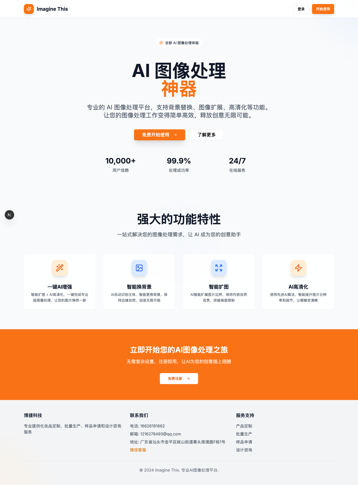
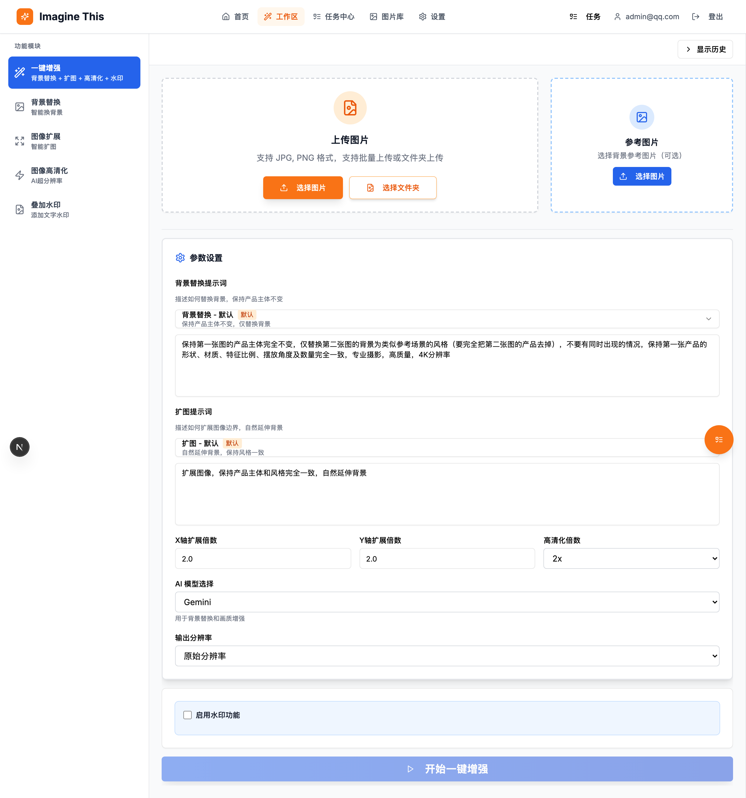
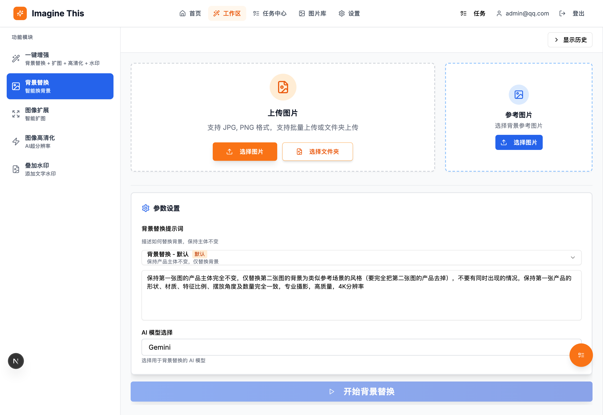
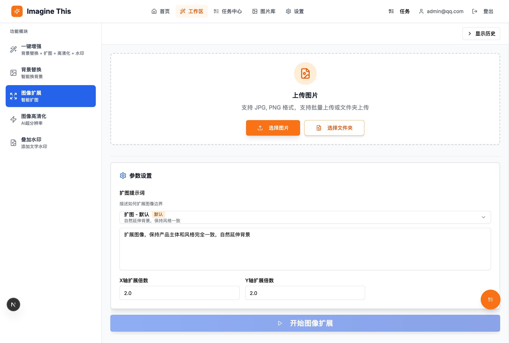
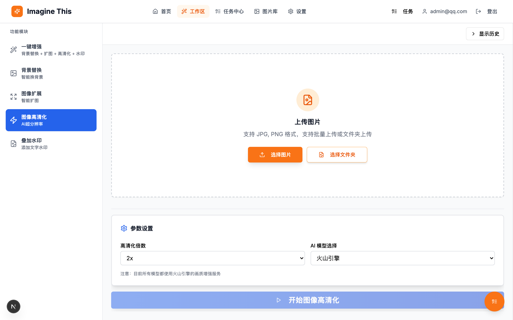
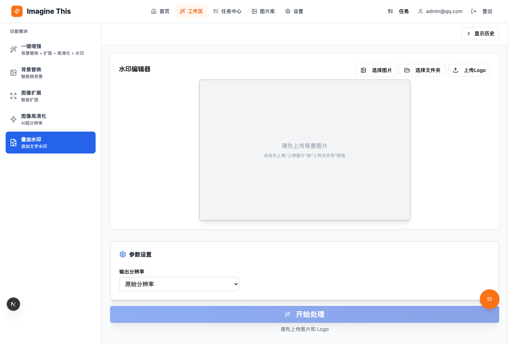
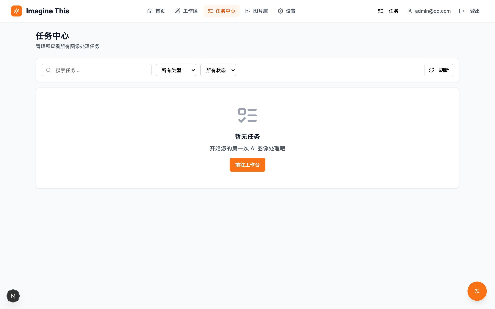
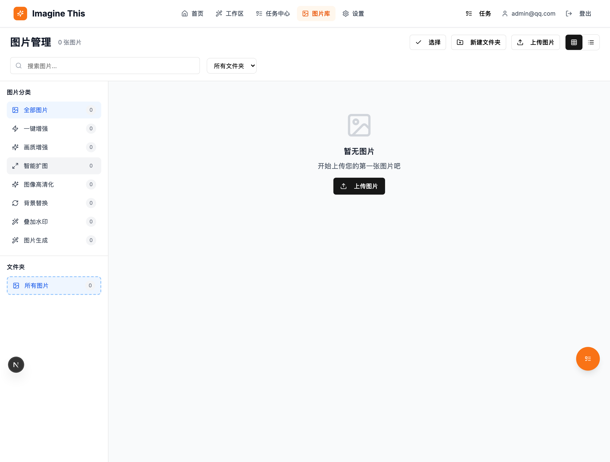

<div align="center">

# Imagine This

**Professional AI Image & Video Processing Platform**

[](https://nextjs.org/)
[](https://www.typescriptlang.org/)
[](https://www.electronjs.org/)
[](https://www.prisma.io/)
[](LICENSE)

[Features](#features) · [Preview](#preview) · [Tech Stack](#tech-stack) · [Quick Start](#quick-start) · [API Docs](#api-documentation)

[中文](README.md)

</div>

---

## Introduction

**Imagine This** is a modern full-stack AI image processing platform built on Next.js 15, supporting both **Web** and **Desktop (Windows / macOS / Linux)** deployments. It integrates multiple advanced AI models (Gemini, GPT-4o, Qwen, Jimeng, Volcengine) to provide professional-grade image processing and video generation capabilities.

## Preview

### Homepage


### Workspace

<details>
<summary>📸 Click to expand all screenshots</summary>

#### One-Click Enhancement


#### Background Replacement


#### Smart Outpainting


#### Image Upscaling


#### Watermark


</details>

### Task Center


### Gallery


## Features

### 🎨 AI Image Processing

| Feature | Description | Supported AI Models |
|---------|-------------|---------------------|
| **One-Click Enhancement** | Combined workflow: background + outpaint + upscale + watermark | Gemini / GPT-4o / Jimeng / Qwen |
| **Background Replacement** | AI detects subject, replaces background while preserving product details | Gemini / GPT-4o / Jimeng / Qwen |
| **Smart Outpainting** | AI extends image boundaries with natural, coherent content | Volcengine |
| **AI Upscaling** | Advanced algorithm for resolution and detail enhancement, supports HDR / WB | Volcengine |
| **Watermark** | Text and Logo watermarks, draggable positioning, free scaling | Local processing |
| **Image-to-Video** | Generate 5s / 10s AI videos from a single image | Jimeng (Volcengine) |

### 🤖 AI Quality Review

- Gemini-powered automatic quality assessment across three dimensions: **product detail preservation**, **texture consistency**, and **background blending** (scored 1-10)
- Automatically identifies issues and provides prompt optimization suggestions
- One-click save high-quality prompts as templates

### 📋 Core Features

- **User Authentication** - Secure auth based on NextAuth.js, supports registration and login
- **Multi-Provider Key Management** - Each user independently configures API keys for Gemini, GPT, Jimeng, Volcengine, and Qwen
- **Task Queue System** - Async processing, batch tasks, real-time progress, auto-retry (up to 3 times)
- **Project Management** - Group images and tasks by project
- **Gallery Management** - Categorized by type, supports folder management
- **Prompt Templates** - Customizable template system, supports system presets + user-defined templates
- **Task History** - Complete processing history, supports retry, cancel, and detail view
- **Image Hosting** - Superbed image hosting, local storage, optional MinIO
- **Desktop App** - Windows, macOS, Linux desktop support with built-in auto-updater
- **Dynamic Model Switching** - Real-time switching between AI providers and models within the workspace

## Tech Stack

### Frontend
| Technology | Version | Purpose |
|------------|---------|---------|
| Next.js | 15.3 | React full-stack framework (App Router) |
| React | 19 | UI library |
| TypeScript | 5.x | Type safety |
| Tailwind CSS | 3.x | Atomic CSS |
| shadcn/ui | - | High-quality UI component library |
| Motion | - | Animation library |
| React Hook Form + Zod | - | Form handling and validation |
| React Konva | - | Canvas watermark editor |

### Backend
| Technology | Version | Purpose |
|------------|---------|---------|
| Next.js API Routes | 15.3 | RESTful API |
| Prisma ORM | 5.22 | Type-safe database access |
| SQLite | - | Database (dev / desktop) |
| NextAuth.js | 4.x | Authentication |
| Sharp | - | Image processing |

### AI Services
| Service | Purpose |
|---------|---------|
| Google Gemini | Background replacement, image understanding, quality review |
| GPT-4o (yunwu.ai) | Background replacement, image understanding |
| Qwen (Tongyi) | Background replacement |
| Volcengine Jimeng | Background replacement, image-to-video |
| Volcengine Vision API | Smart outpainting, image upscaling |
| Superbed | Image hosting service |

### Desktop
| Technology | Version | Purpose |
|------------|---------|---------|
| Electron | 39.x | Desktop application framework |
| electron-builder | 26.x | App packaging |
| electron-updater | - | Auto-updater |

## Quick Start

### Requirements

- Node.js 20.x - 23.x (LTS recommended)
- npm or pnpm

### Installation

```bash
# 1. Clone the repo
git clone https://github.com/yourusername/ai-images-generated.git
cd ai-images-generated

# 2. Install dependencies
npm install

# 3. Configure environment
cp .env.example .env
# Edit .env to set DATABASE_URL and NEXTAUTH_SECRET

# 4. Initialize database
# By default, the repo includes a SQLite template at prisma/app.db (ready to use).
# To start fresh, change DATABASE_URL to file:./dev.db, then run:
# npx prisma db push
# npx prisma generate

# 5. Start dev server
npm run dev
```

Visit [http://localhost:34123](http://localhost:34123) to view the app.

### Desktop Development

```bash
# Start both web service and Electron desktop app
npm run electron:dev
```

## API Setup Guide

The following API services are required to use all features.

### 1. GPT and Gemini API

For image understanding, background replacement, and quality review.

**Register:** [https://yunwu.zeabur.app/register?aff=lulv](https://yunwu.zeabur.app/register?aff=lulv)

**Channels to configure:**
- **Gemini**: Image understanding, background replacement, quality review
- **Azure OpenAI (GPT-4o)**: Alternative for image understanding

Create an API Key on the platform, then configure it in the app's settings page.

### 2. Volcengine Jimeng API

For smart outpainting, upscaling, and video generation.

**Feature pages:**
- **Video Generation**: [https://console.volcengine.com/ai/ability/detail/2](https://console.volcengine.com/ai/ability/detail/2)
- **Smart Outpainting**: [https://console.volcengine.com/ai/ability/detail/10](https://console.volcengine.com/ai/ability/detail/10)
- **Background Replacement**: [https://console.volcengine.com/ai/ability/detail/1](https://console.volcengine.com/ai/ability/detail/1)

**Create key:** [https://console.volcengine.com/iam/keymanage](https://console.volcengine.com/iam/keymanage)

> ⚠️ **Note:** Volcengine console pages are scattered. Bookmark the links above for easy access.

### 3. Qwen API (Optional)

Alternative for background replacement.

## Deployment

### Desktop Packaging (Recommended)

```bash
# Package Windows version (auto cleans cache)
npm run build:windows

# Package macOS version (auto cleans cache)
npm run build:mac
```

Artifacts are located in `dist-electron/`:
- **Windows**: `ImagineThis-x.x.x-x64-Setup.exe` (Installer), `ImagineThis-x.x.x-x64-Portable.exe` (Portable)
- **macOS**: `ImagineThis-x.x.x.dmg` (Intel / Apple Silicon)

### Web Deployment

```bash
# Build
npm run build

# Start production server
npm start
```

## API Documentation

### Image Processing
| Endpoint | Method | Description |
|----------|--------|-------------|
| `/api/images-process/workflow/one-click` | POST | One-click enhancement workflow |
| `/api/images-process/background-replace` | POST | Background replacement |
| `/api/images-process/outpaint` | POST | Smart outpainting |
| `/api/images-process/enhance` | POST | Image upscaling |
| `/api/images-process/watermark` | POST | Add watermark |

### Video Generation
| Endpoint | Method | Description |
|----------|--------|-------------|
| `/api/jimeng-video/submit` | POST | Submit image-to-video task |
| `/api/jimeng-video/query` | POST | Query video generation result |

### Quality Review
| Endpoint | Method | Description |
|----------|--------|-------------|
| `/api/quality-review` | POST | AI quality review |

### Task Management
| Endpoint | Method | Description |
|----------|--------|-------------|
| `/api/tasks` | GET / POST | List / create tasks |
| `/api/tasks/:id` | GET / DELETE | Get detail / delete |
| `/api/tasks/retry` | POST | Retry failed tasks |
| `/api/tasks/recover` | POST | Recover stuck tasks |
| `/api/tasks/cron` | POST | Cron polling |
| `/api/tasks/worker` | POST | Task worker |

### Images & Files
| Endpoint | Method | Description |
|----------|--------|-------------|
| `/api/images` | GET / POST | List / create image records |
| `/api/images/:id` | GET / DELETE | Get / delete image |
| `/api/files/:path*` | GET | Local file access |

### Prompt Templates
| Endpoint | Method | Description |
|----------|--------|-------------|
| `/api/prompt-templates` | GET / POST | List / create templates |
| `/api/prompt-templates/:id` | PUT / DELETE | Update / delete template |

### Projects & Settings
| Endpoint | Method | Description |
|----------|--------|-------------|
| `/api/projects` | GET / POST | List / create projects |
| `/api/projects/:id` | GET / PUT / DELETE | Detail / update / delete |
| `/api/settings` | GET / PUT | User settings (incl. API keys) |
| `/api/models` | GET | List available AI models |

## Project Structure

```
ai-images-generated/
├── src/
│   ├── app/                    # Next.js App Router
│   │   ├── api/               # API routes
│   │   │   ├── images-process/  # Image processing APIs
│   │   │   ├── jimeng-video/    # Video generation APIs
│   │   │   ├── quality-review/  # Quality review API
│   │   │   ├── tasks/           # Task management APIs
│   │   │   └── ...
│   │   ├── auth/              # Auth pages
│   │   ├── gallery/           # Gallery page
│   │   ├── history/           # Task center page
│   │   ├── settings/          # Settings page
│   │   └── workspace/         # Workspace page
│   ├── components/            # React components
│   │   ├── ui/               # shadcn/ui components
│   │   └── workspace/        # Workspace components
│   ├── lib/                  # Utilities
│   │   ├── image-processor/  # Image processing core (factory pattern)
│   │   └── ...
│   └── stores/               # Zustand state management
├── prisma/                   # Prisma database
│   └── schema.prisma        # Database schema
├── electron/                 # Electron desktop app
├── scripts/                  # Build scripts
├── docs/                     # Docs & screenshots
└── public/                   # Static assets
```

## Development Guide

### Regenerate README Screenshots

```bash
# First time: install browser dependencies
npx playwright install chromium

# Generate screenshots
npm run screenshots:readme

# If you already have the dev server running
SCREENSHOT_SKIP_SERVER=true npm run screenshots:readme
```

Output: `docs/screenshots/*.png`

### Common Commands

```bash
# Development
npm run dev              # Start dev server (port 34123)
npm run electron:dev     # Start Electron dev mode

# Build
npm run build            # Build Next.js
npm run build:windows    # Package Windows desktop app
npm run build:mac        # Package macOS desktop app

# Cleanup
npm run clean            # Clean build caches

# Database
npx prisma studio        # Open Prisma Studio
npx prisma db push       # Push schema changes
npx prisma generate      # Generate Prisma Client
```

## Contributing

Contributions are welcome! Please follow these steps:

1. Fork this repository
2. Create a feature branch (`git checkout -b feature/AmazingFeature`)
3. Commit your changes (`git commit -m 'Add some AmazingFeature'`)
4. Push to the branch (`git push origin feature/AmazingFeature`)
5. Open a Pull Request

## License

This project is licensed under the MIT License - see the [LICENSE](LICENSE) file for details.

## Acknowledgements

- [Next.js](https://nextjs.org/) - React full-stack framework
- [shadcn/ui](https://ui.shadcn.com/) - Beautiful UI component library
- [Prisma](https://www.prisma.io/) - Modern ORM
- [Volcengine Jimeng](https://www.volcengine.com/) - AI image & video processing service

## Contact

- Project homepage: [https://github.com/yourusername/ai-images-generated](https://github.com/yourusername/ai-images-generated)
- Issue tracker: [Issues](https://github.com/yourusername/ai-images-generated/issues)

---

<div align="center">

**If this project helps you, please consider giving it a Star**

Imagine This Team

</div>
