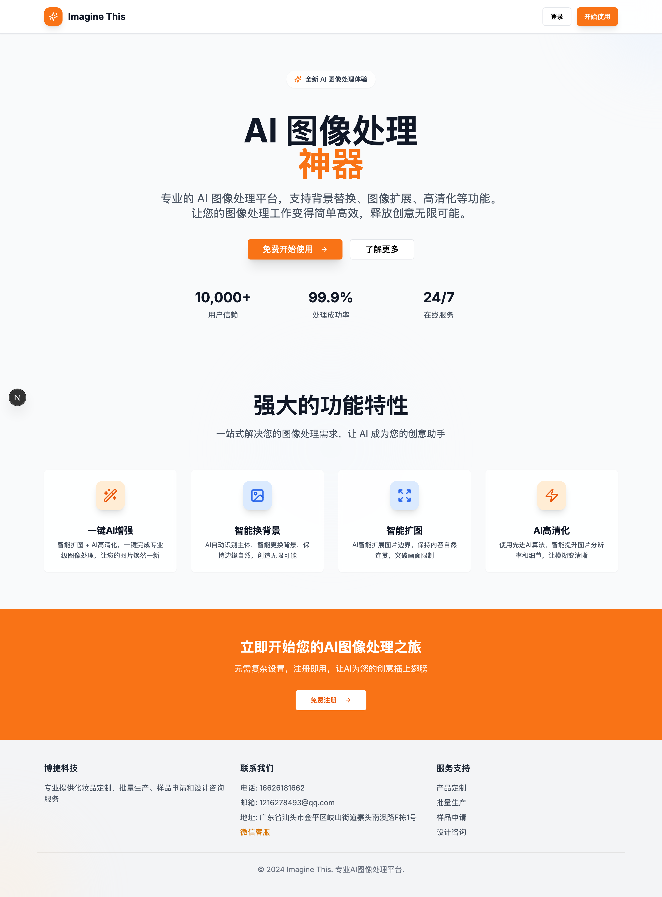
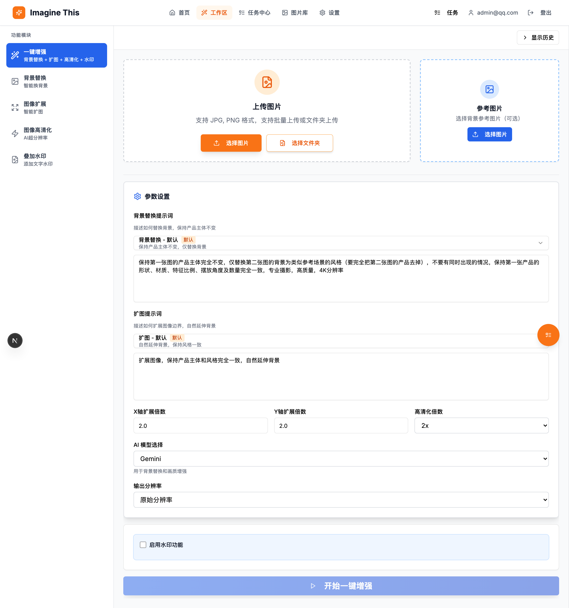
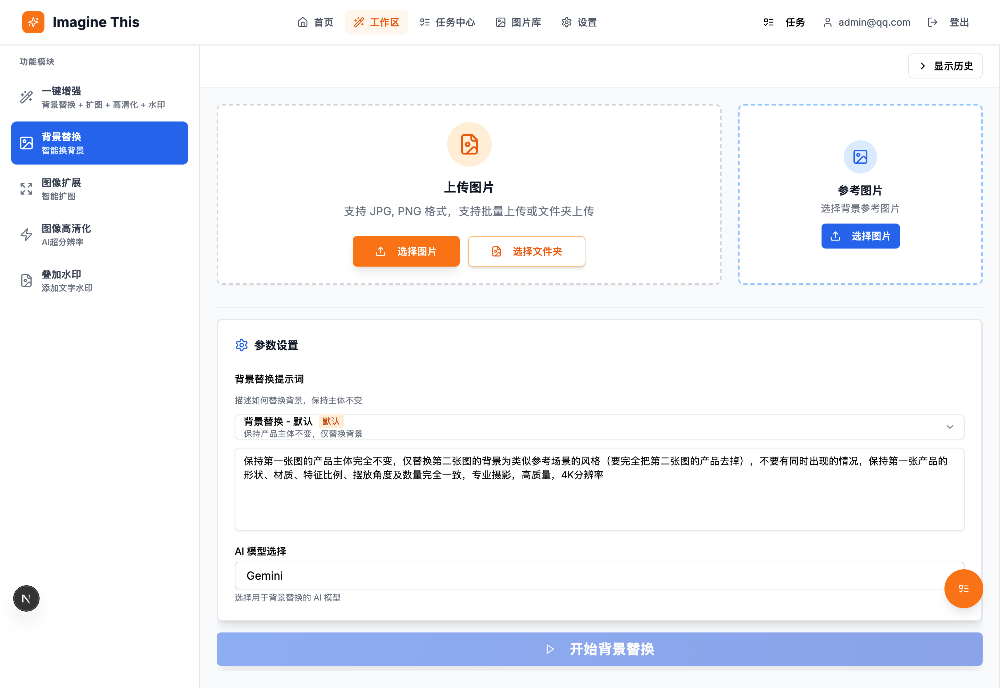
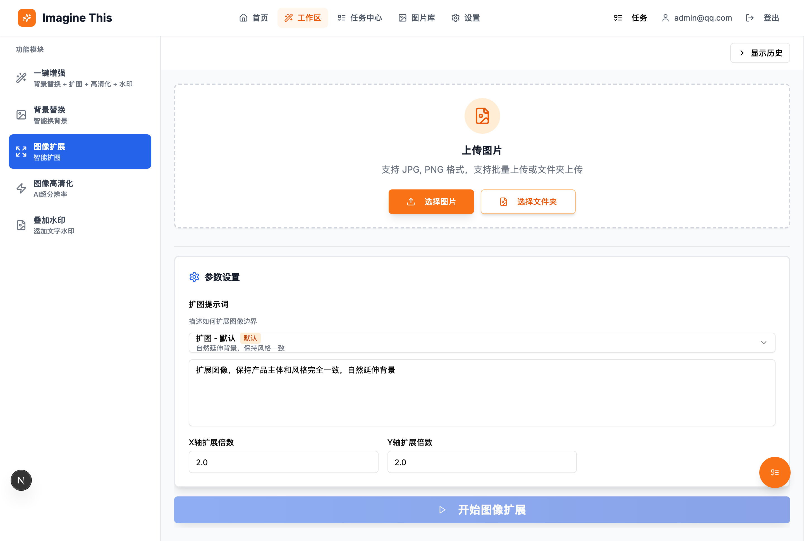
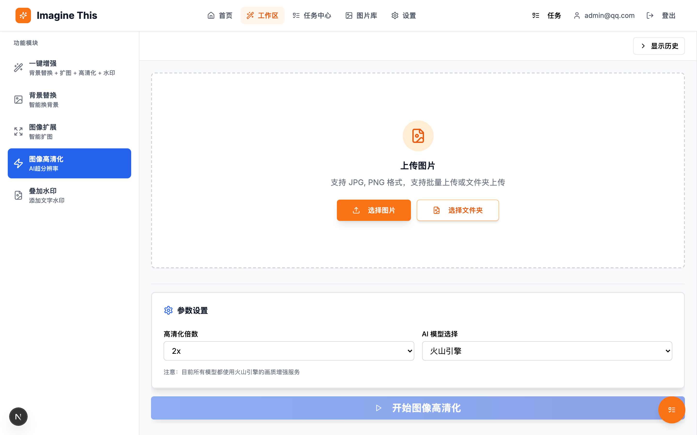
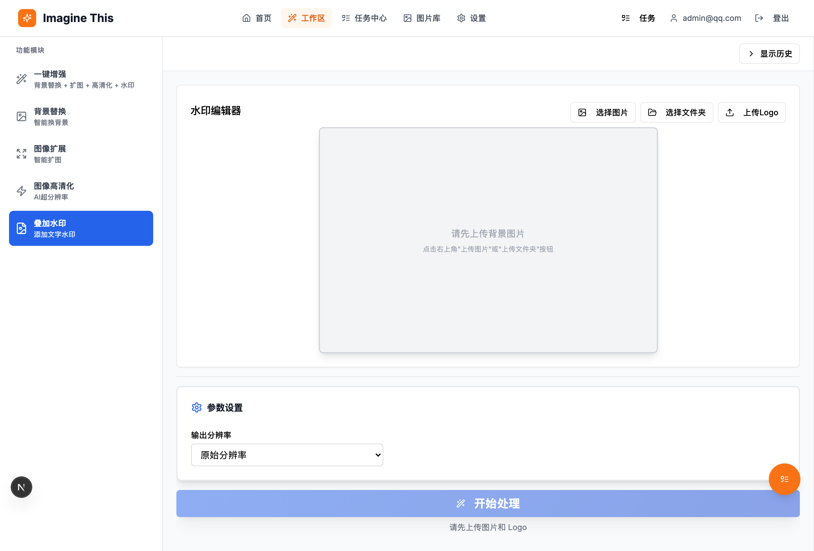
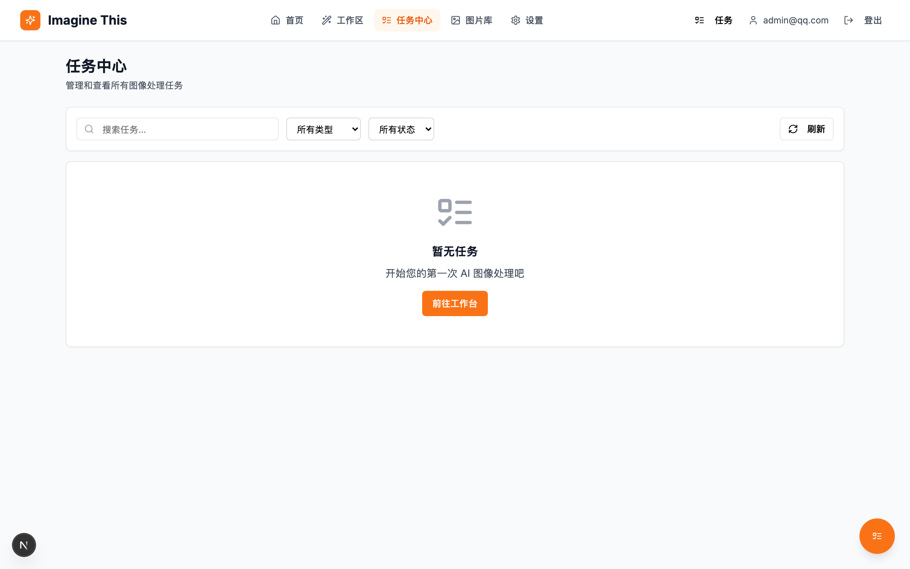
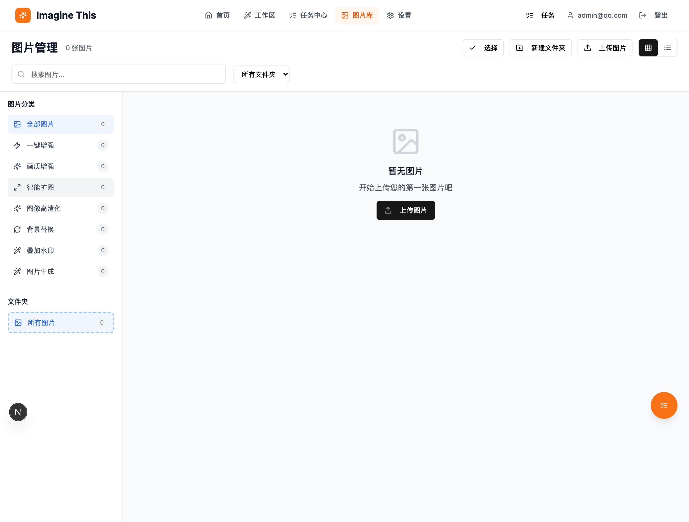

<div align="center">

# Imagine This

**专业的 AI 图像处理平台**

[](https://nextjs.org/)
[](https://www.typescriptlang.org/)
[](https://www.electronjs.org/)
[](https://www.prisma.io/)
[](LICENSE)

[功能特性](#功能特性) • [界面预览](#界面预览) • [技术栈](#技术栈) • [快速开始](#快速开始) • [部署](#部署)

</div>

---

## 项目简介

**Imagine This** 是一个基于 Next.js 15 构建的现代化全栈 AI 图像处理平台，支持 **Web 端** 和 **桌面端（Windows/macOS）** 双平台运行。集成了多种先进的 AI 模型（Gemini、GPT-4 Vision、即梦），为用户提供专业级的图像处理能力。

## 界面预览

### 首页


### 工作区功能

<details>
<summary>📸 点击展开查看所有功能截图</summary>

#### 一键增强


#### 背景替换


#### 智能扩图


#### 图像高清化


#### 叠加水印


</details>

### 任务中心


### 图片库


## 功能特性

### 🎨 AI 图像处理

| 功能 | 描述 | 支持的 AI 模型 |
|------|------|---------------|
| **一键增强** | 背景替换 + 智能扩图 + 高清化 + 水印，一键完成 | Gemini / GPT-4 / 即梦 |
| **智能换背景** | AI 自动识别主体，精准更换背景 | Gemini / GPT-4 / 即梦 |
| **智能扩图** | AI 智能扩展图片边界，保持内容自然连贯 | 火山引擎 |
| **AI 高清化** | 使用先进算法提升分辨率和细节 | 火山引擎 |
| **叠加水印** | 支持文字水印，可自定义位置和样式 | 本地处理 |

### 📋 核心功能

- **用户认证系统** - 基于 NextAuth.js 的安全认证
- **任务队列系统** - 异步处理，支持批量任务，实时进度反馈
- **图片库管理** - 按类型分类，支持文件夹管理
- **提示词模板** - 可自定义的提示词模板系统
- **任务历史** - 完整的处理历史记录，支持重试和查看详情
- **图床集成** - 支持 Superbed 图床服务
- **桌面应用** - 支持 Windows 和 macOS 桌面端

## 技术栈

### 前端
| 技术 | 版本 | 用途 |
|------|------|------|
| Next.js | 15.3 | React 全栈框架 (App Router) |
| React | 19 | UI 库 |
| TypeScript | 5.x | 类型安全 |
| Tailwind CSS | 3.x | 原子化 CSS |
| shadcn/ui | - | 高质量 UI 组件库 |
| Framer Motion | - | 动画库 |
| React Hook Form + Zod | - | 表单处理和验证 |

### 后端
| 技术 | 版本 | 用途 |
|------|------|------|
| Next.js API Routes | 15.3 | RESTful API |
| Prisma ORM | 5.22 | 类型安全的数据库访问 |
| SQLite | - | 数据库（开发/桌面端） |
| NextAuth.js | 4.x | 身份认证 |
| Sharp | - | 图像处理 |

### AI 服务
| 服务 | 用途 |
|------|------|
| Google Gemini | 背景替换、图像理解 |
| GPT-4 Vision | 背景替换、图像理解 |
| 火山引擎即梦 | 背景替换、智能扩图、高清化 |
| Superbed | 图床服务 |

### 桌面端
| 技术 | 版本 | 用途 |
|------|------|------|
| Electron | 39.x | 桌面应用框架 |
| electron-builder | 26.x | 应用打包 |

## 快速开始

### 环境要求

- Node.js 20.x（推荐使用 LTS 版本）
- npm 或 pnpm

### 安装步骤

```bash
# 1. 克隆项目
git clone https://github.com/yourusername/ai-images-generated.git
cd ai-images-generated

# 2. 安装依赖
npm install

# 3. 配置环境变量
cp .env.example .env
# 编辑 .env 文件，配置必要的 API Key

# 4. 初始化数据库
# 默认配置会使用仓库内置的 SQLite 模板库：prisma/app.db（可直接启动）。
# 如果你希望使用全新的空库，请把 DATABASE_URL 改为 file:./dev.db，然后执行：
# npx prisma db push
# npx prisma generate

# 5. 启动开发服务器
npm run dev
```

访问 [http://localhost:23000](http://localhost:23000) 查看应用。

## 部署

### 桌面应用打包（推荐）

```bash
# 打包 Windows 版本（自动清理缓存）
npm run build:windows

# 打包 macOS 版本（自动清理缓存）
npm run build:mac
```

打包产物位于 `dist-electron/` 目录：
- **Windows**: `ImagineThis-x.x.x-x64-Setup.exe`（安装版）、`ImagineThis-x.x.x-x64-Portable.exe`（便携版）
- **macOS**: `ImagineThis-x.x.x.dmg`

### Web 服务部署

```bash
# 构建
npm run build

# 使用 PM2 启动
npm run pm2:start
```

### Docker 部署

```bash
docker build -t imagine-this .
docker run -d -p 34000:3000 --env-file .env --name imagine-this imagine-this
```

## API 文档

### 图像处理
| 端点 | 方法 | 描述 |
|------|------|------|
| `/api/images-process/workflow/one-click` | POST | 一键增强工作流 |
| `/api/images-process/background-replace` | POST | 背景替换 |
| `/api/images-process/outpaint` | POST | 智能扩图 |
| `/api/images-process/enhance` | POST | 画质增强 |
| `/api/images-process/watermark` | POST | 叠加水印 |

### 任务管理
| 端点 | 方法 | 描述 |
|------|------|------|
| `/api/tasks` | GET | 获取任务列表 |
| `/api/tasks/:id` | GET | 获取任务详情 |
| `/api/tasks/:id` | DELETE | 删除任务 |
| `/api/tasks/retry` | POST | 重试失败任务 |
| `/api/tasks/worker` | POST | 任务处理器 |

### 图片管理
| 端点 | 方法 | 描述 |
|------|------|------|
| `/api/images` | GET | 获取图片列表 |
| `/api/images/:id` | DELETE | 删除图片 |

### 提示词模板
| 端点 | 方法 | 描述 |
|------|------|------|
| `/api/prompt-templates` | GET/POST | 获取/创建模板 |
| `/api/prompt-templates/:id` | PUT/DELETE | 更新/删除模板 |

```
ai-images-generated/
├── src/
│   ├── app/                    # Next.js App Router
│   │   ├── api/               # API 路由
│   │   │   ├── images-process/  # 图像处理 API
│   │   │   ├── tasks/           # 任务管理 API
│   │   │   └── ...              # 其他 API
│   │   ├── auth/              # 认证页面
│   │   ├── gallery/           # 图片库页面
│   │   ├── history/           # 任务中心页面
│   │   ├── settings/          # 设置页面
│   │   └── workspace/         # 工作区页面
│   ├── components/            # React 组件
│   │   ├── ui/               # shadcn/ui 组件
│   │   └── workspace/        # 工作区组件
│   ├── lib/                  # 工具库
│   │   ├── image-processor/  # 图像处理核心
│   │   └── ...               # 其他工具
│   └── hooks/                # 自定义 Hooks
├── prisma/                   # Prisma 数据库
│   └── schema.prisma        # 数据库模型
├── electron/                 # Electron 桌面端
│   ├── main.js              # 主进程
│   └── preload.js           # 预加载脚本
├── scripts/                  # 构建脚本
│   ├── build-windows.mjs    # Windows 打包
│   └── build-mac.mjs        # macOS 打包
├── docs/                     # 文档
│   └── screenshots/         # 界面截图
└── public/                   # 静态资源
```

## 开发指南

### 重新生成 README 截图

如果 `docs/screenshots/` 下截图缺失，可以用 Playwright 自动启动本地服务并重建这些图片文件（文件名与 README 引用保持一致）。

```bash
# 首次需要安装浏览器依赖（会下载 Chromium）
npx playwright install chromium

# 一键生成 README 截图（默认会自动启动 Next.js dev server）
npm run screenshots:readme

# 如果你想自己先启动服务（例如在受限环境中），可以这样运行：
# 终端 A：npm run dev
# 终端 B：SCREENSHOT_SKIP_SERVER=true npm run screenshots:readme
```

生成产物：`docs/screenshots/*.png`

### 常用命令

```bash
# 开发
npm run dev              # 启动开发服务器 (端口 23000)
npm run electron:dev     # 启动 Electron 开发模式

# 构建
npm run build            # 构建 Next.js
npm run build:windows    # 打包 Windows 桌面应用
npm run build:mac        # 打包 macOS 桌面应用

# 清理
npm run clean            # 清理构建缓存

# 数据库
npx prisma studio        # 打开 Prisma Studio
npx prisma migrate dev   # 创建并应用迁移
npx prisma generate      # 生成 Prisma Client
```

## 贡献指南

欢迎贡献！请遵循以下步骤：

1. Fork 本仓库
2. 创建特性分支 (`git checkout -b feature/AmazingFeature`)
3. 提交更改 (`git commit -m 'Add some AmazingFeature'`)
4. 推送到分支 (`git push origin feature/AmazingFeature`)
5. 开启 Pull Request

## 许可证

本项目采用 MIT 许可证 - 查看 [LICENSE](LICENSE) 文件了解详情。

## 致谢

- [Next.js](https://nextjs.org/) - React 全栈框架
- [shadcn/ui](https://ui.shadcn.com/) - 精美的 UI 组件库
- [Prisma](https://www.prisma.io/) - 现代化 ORM
- [火山引擎即梦](https://www.volcengine.com/) - AI 图像处理服务

## 联系方式

- 项目主页: [https://github.com/yourusername/ai-images-generated](https://github.com/yourusername/ai-images-generated)
- 问题反馈: [Issues](https://github.com/yourusername/ai-images-generated/issues)

---

<div align="center">

**如果这个项目对你有帮助，欢迎给予 Star 支持**

Imagine This Team

</div>
