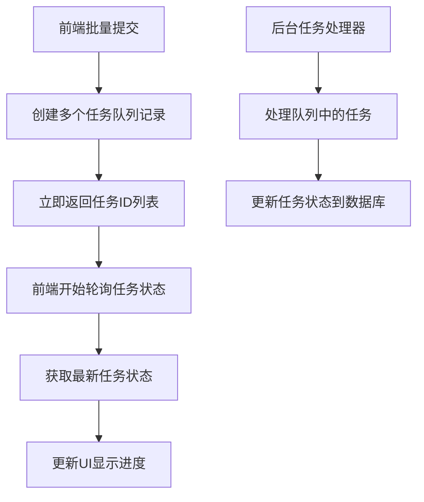

# 批量任务处理机制优化 - 任务分析与解决方案

## 复杂度级别: Level 4
**理由**: 涉及前端状态管理、后端异步任务队列、数据库设计、API协调等多个层面的复杂改造

## 问题分析

### 核心问题
用户反馈的严峻问题：前端工作台批量提交任务时，任务不会立刻创建多个后台任务，而是完成一个生成一个，导致用户切换界面后未开始的任务会失败。

### 当前实现分析

#### 1. 前端批量处理逻辑
- **位置**: `src/app/workspace/page.tsx:541-616` (handleOneClick函数)
- **问题**: 使用同步循环 `for (let i = 0; i < uploadedImages.length; i++)` 
- **缺陷**: 
  - 一个接一个串行处理，无法并行
  - 用户切换页面时，fetch请求可能被中断
  - 没有持久化的任务状态管理

#### 2. API端点处理
- **位置**: `src/app/api/workflow/one-click/route.ts:323-566`
- **问题**: API只处理单张图片，没有批量处理机制
- **缺陷**:
  - 每次请求创建单个ProcessedImage记录
  - 没有任务队列机制
  - 长时间处理容易超时

#### 3. 任务队列系统
- **位置**: `src/app/api/tasks/worker/route.ts`
- **现状**: 已有TaskQueue模型和基础处理器，但未被前端使用
- **机会**: 可以利用现有的任务队列基础设施

## 解决方案设计

### 方案1: 最小化改动 - 前端异步提交 + 任务队列集成 (推荐)

#### 优势
- 保持现有API结构不变
- 复用现有TaskQueue基础设施
- 改动范围小，风险可控
- 用户体验立即提升

#### 实现步骤

1. **前端改造** (复杂度: ⭐⭐)
   - 修改批量处理函数，改为并行提交任务到队列
   - 添加任务状态轮询机制
   - 优化UI显示批量任务进度

2. **任务创建API增强** (复杂度: ⭐⭐)
   - 修改 `/api/tasks/route.ts` 支持批量任务创建
   - 添加任务批次管理

3. **任务处理器增强** (复杂度: ⭐⭐⭐)
   - 完善 `TaskProcessor` 类，集成现有API调用
   - 添加任务状态广播机制

### 方案2: 深度重构 - 纯异步架构 

#### 优势
- 完全解耦前后端处理
- 最佳的可扩展性
- 支持复杂的工作流编排

#### 劣势
- 改动量巨大
- 引入复杂的状态同步机制
- 开发和测试时间长

## 推荐实施方案: 方案1

### 架构概览

### 组件修改清单

#### 1. 前端组件 (`src/app/workspace/page.tsx`)
- **修改点**: `handleOneClick`, `handleExpansion`, `handleUpscaling`, `handleBackgroundReplace`
- **变更**: 改为批量创建任务 + 轮询状态模式

#### 2. 任务API (`src/app/api/tasks/route.ts`)
- **修改点**: POST方法
- **新增**: 批量任务创建接口

#### 3. 任务处理器 (`src/app/api/tasks/worker/route.ts`) 
- **修改点**: TaskProcessor类
- **增强**: 集成现有的图像处理API调用

### 潜在风险与缓解措施

#### 1. 并发处理风险
- **风险**: 大量任务同时处理可能导致资源竞争
- **缓解**: 实现任务并发限制机制

#### 2. 任务状态同步风险
- **风险**: 前端轮询与后端处理的状态不一致
- **缓解**: 使用数据库事务确保状态原子性更新

#### 3. API速率限制风险
- **风险**: 第三方API(通义千问/GPT)的速率限制
- **缓解**: 实现指数退避重试机制

#### 4. 用户体验风险
- **风险**: 轮询可能导致前端性能问题
- **缓解**: 智能轮询间隔调整，完成任务减少轮询频率

### 开发时间估计
- **前端改造**: 2-3天
- **后端任务队列集成**: 3-4天  
- **测试与优化**: 2-3天
- **总计**: 7-10天

## 创意阶段需求

### 需要创意设计的组件

1. **任务状态实时同步机制设计**
   - 轮询策略优化
   - WebSocket vs 短轮询选择

2. **并发控制算法设计**
   - 任务优先级队列
   - 资源限制策略

3. **用户体验优化设计**
   - 批量任务进度可视化
   - 失败任务重试机制

## 下一步行动
建议进入 **CREATIVE模式** 来详细设计：
1. 任务状态同步机制
2. 并发控制策略  
3. UI/UX改进方案 